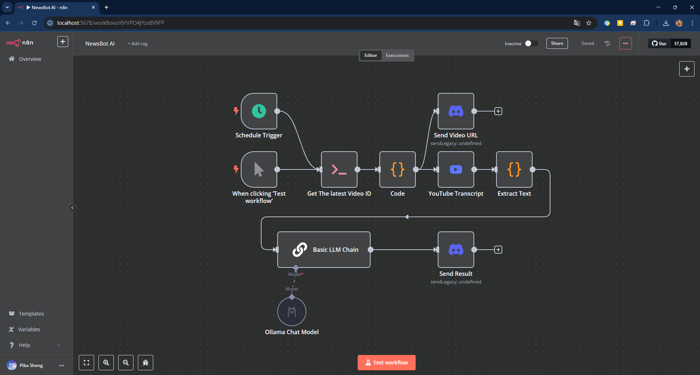
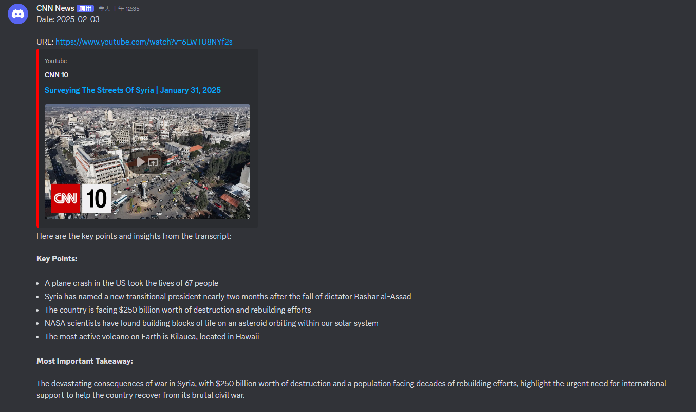

# NewsBot AI

**NewsBot AI** automates daily CNN news summaries using **n8n**, **Ollama**, and **Discord Webhooks**, delivering key insights efficiently. It runs in Docker and supports future expansions like multilingual support and personalized news categories.

<div style="display: flex; justify-content: space-between;">
  
  
</div>

## Usage

### Run with Docker

Create a [Dockerfile](./Dockerfile) for n8n and Ollama, and a [docker-compose.yml](./docker-compose.yml) file to run both services.

```bash
# Pull latest version
docker compose pull

# Stop and remove older version
docker compose down

# Build the container
docker-compose build

# Start the container
docker compose up -d
```

- Open `http://localhost:5678` to access the n8n UI.
- Ollama Base Url: `http://host.docker.internal:11434/`
- Download model: `docker exec -it ollama ollama run <model_name>`

### Import Workflow

- Open `http://localhost:5678` and import the workflow from `./NewsBot_AI.json`.

## Reference

- [n8n Doc](https://docs.n8n.io)
- [n8n Docker Image](https://hub.docker.com/r/n8nio/n8n)
- [Ollama](https://ollama.com/)
- [Ollama Docker Image](https://hub.docker.com/r/ollama/ollama)
